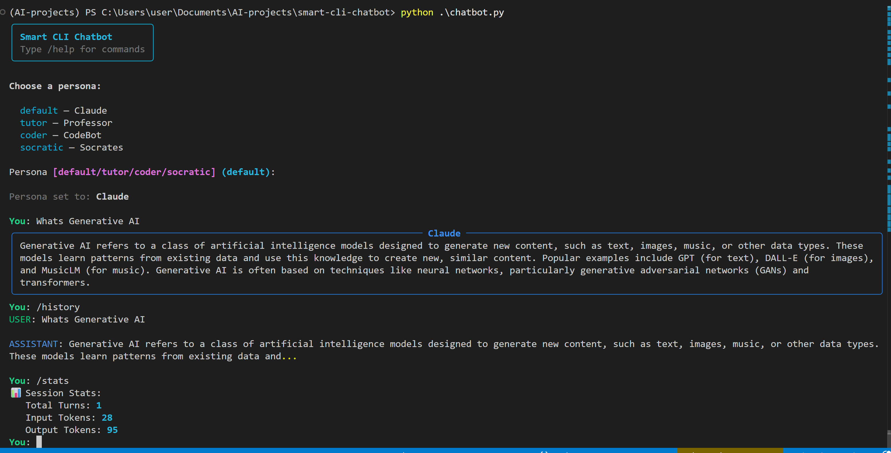

# 🤖 Smart CLI Chatbot

> A multi-turn terminal chatbot powered by Claude (Anthropic API) with persona switching, token tracking, and conversation memory — built as part of my Generative AI learning journey.

[](https://www.python.org/)
[](https://platform.claude.com/docs/en/home)
[](https://github.com/OlawoyeTaofeek/Zero-to-AI-engineer/blob/main/LICENSE)


---

## 📌 What It Does

This is a fully functional command-line chatbot that goes beyond a simple "call the API and print the result." It demonstrates the **core patterns** that every production-grade AI assistant is built on:

- **Multi-turn conversation memory** — the bot remembers everything you've said in the session
- **Persona system** — choose a personality at startup (Default, Tutor, CodeBot, Socrates) that shapes how the AI responds
- **Token usage tracking** — see how many input/output tokens each turn uses and the running session total
- **Slash commands** — in-chat commands to view stats, clear history, replay the conversation, or quit
- **Clean terminal UI** — formatted panels, color-coded speakers, and a loading spinner via the `rich` library

---

## 🖥️ What It Looks Like

### Startup & Persona Selection
```
╭─────────────────────────────╮
│     Smart CLI Chatbot       │
│   Type /help for commands   │
╰─────────────────────────────╯

Choose a persona:

  default  — Claude
  tutor    — Professor
  coder    — CodeBot
  socratic — Socrates

Persona: coder
Persona set to: CodeBot
```

### Live Conversation
```
You: How do I reverse a list in Python?

╭─ CodeBot ───────────────────────────────────────────────╮
│ Great question! Here are the two main approaches:       │
│                                                         │
│ 1. Using slicing (creates a new list):                  │
│    my_list[::-1]                                        │
│                                                         │
│ 2. In-place using .reverse():                           │
│    my_list.reverse()                                    │
│                                                         │
│ Use slicing when you want to keep the original.         │
│ Use .reverse() when memory efficiency matters.          │
╰─────────────────────────────────────────────────────────╯
```

### Token Stats (`/stats`)
```
╭─ Session stats ─╮
│  Turns          4  │
│  Input tokens   892 │
│  Output tokens  310 │
│  Total tokens   1202│
╰────────────────────╯
```





---

## 🧠 What This Demonstrates

| Concept | What You'll See in the Code |
|---|---|
| **LLM API integration** | Using the Anthropic Python SDK to call `claude-sonnet` |
| **Multi-turn memory** | Building and passing a `messages[]` list with every API call |
| **System prompt engineering** | Persona behaviour defined entirely via the `system` parameter |
| **Token awareness** | Reading `response.usage` and accumulating across turns |
| **Context window management** | Understanding why history grows input costs over time |
| **CLI UX design** | Using `rich` for panels, colors, spinners, and prompts |

> **Key insight:** The model has zero memory of its own. Every time you send a message, you're sending the *entire conversation history*. The `messages` list IS the memory.

---

## 🗂️ Project Structure

```
smart-cli-chatbot/
│
├── chatbot.py          # Main application — chat loop, commands, UI
├── personas.py         # Persona definitions (name + system prompt)
├── .env                # Your API key (never commit this!)
├── .gitignore          # Excludes .env, venv, __pycache__
├── requirements.txt    # Dependencies
└── README.md           # This file
```

---

## ⚙️ Tech Stack

| Tool | Purpose |
|---|---|
| **Python 3.9+** | Core language |
| **Anthropic SDK** (`anthropic`) | Claude API client |
| **Rich** (`rich`) | Terminal formatting — panels, colors, spinners |
| **python-dotenv** | Load API key from `.env` file |
| **Claude Sonnet** | The underlying LLM model |

---

## 🚀 Installation & Setup

### 1. Clone the repo

```bash
git clone https://github.com/YOUR_USERNAME/smart-cli-chatbot.git
cd smart-cli-chatbot
```

### 2. Create and activate a virtual environment

```bash
python -m venv venv

# macOS / Linux
source venv/bin/activate

# Windows
venv\Scripts\activate
```

### 3. Install dependencies

```bash
pip install -r requirements.txt
```

`requirements.txt`:
```
anthropic>=0.25.0
python-dotenv>=1.0.0
rich>=13.0.0
```

### 4. Get your Anthropic API key

1. Go to [console.anthropic.com](https://console.anthropic.com)
2. Sign up / log in
3. Navigate to **API Keys** → **Create Key**
4. Copy the key

### 5. Create your `.env` file

```bash
touch .env
```

Add this line to `.env`:
```
ANTHROPIC_API_KEY=sk-ant-your-key-here
```

> ⚠️ **Never commit your `.env` file.** It's already in `.gitignore`.

### 6. Run the chatbot

```bash
python chatbot.py
```

---

## 🎮 How to Use

### Choosing a persona

At startup you'll be prompted to pick a persona. Each one has a different system prompt that changes the AI's behaviour:

| Persona | Name | Best for |
|---|---|---|
| `default` | Claude | General Q&A |
| `tutor` | Professor | Learning new topics step by step |
| `coder` | CodeBot | Programming help with explained code |
| `socratic` | Socrates | Deep thinking — guides you with questions |

### Slash commands (in-chat)

| Command | What it does |
|---|---|
| `/help` | Show all available commands |
| `/stats` | Display token usage for the session |
| `/history` | Replay the conversation so far |
| `/clear` | Wipe history and start fresh (same persona) |
| `/quit` or `/q` | Exit and show final session stats |

### Example session

```
You: Explain recursion like I'm a beginner

╭─ Professor ────────────────────────────────────────────╮
│ Great topic! Let's build up to it step by step...      │
│ Imagine a Russian nesting doll. Each doll contains     │
│ a smaller version of itself — until you reach the      │
│ tiniest one that doesn't open. That's recursion.       │
│                                                        │
│ A function that calls itself, with a base case         │
│ that stops it. Do you want to see a code example?      │
╰────────────────────────────────────────────────────────╯

You: yes please

You: /stats

╭─ Session stats ──╮
│  Turns        2  │
│  Input tokens 445│
│  Output tokens 178│
│  Total       623 │
╰──────────────────╯
```

---

## 🔧 Configuration & Customisation

### Add a new persona

Open `personas.py` and add an entry to the `PERSONAS` dict:

```python
"analyst": {
    "name": "DataBot",
    "system": (
        "You are a data analyst. Always think in terms of data, "
        "metrics, and evidence. Suggest charts or tables when relevant. "
        "Be precise and avoid vague language."
    )
}
```

Restart the chatbot — it will appear in the selection menu automatically.

### Enable streaming output

Replace the `chat()` function in `chatbot.py` to stream tokens word-by-word:

```python
def chat_streaming(messages: list, system_prompt: str):
    with client.messages.stream(
        model="claude-sonnet-4-20250514",
        max_tokens=1024,
        system=system_prompt,
        messages=messages
    ) as stream:
        full_text = ""
        for text in stream.text_stream:
            console.print(text, end="", highlight=False)
            full_text += text
        console.print()
        return full_text, stream.get_final_message().usage
```

### Limit history to control costs

Add this inside the main loop before the API call to keep only the last N turns:

```python
MAX_TURNS = 10
if len(messages) > MAX_TURNS * 2:
    messages = messages[-(MAX_TURNS * 2):]
```

### Save conversations to disk

Add this after each assistant reply:

```python
import json
with open("session_log.json", "w") as f:
    json.dump(messages, f, indent=2)
```

---

## 💡 Key Concepts Explained

### Why does the bot remember what I said?

Every time you send a message, the full `messages` list is sent to the API:

```python
messages = [
    {"role": "user",      "content": "What is Python?"},
    {"role": "assistant", "content": "Python is a programming language..."},
    {"role": "user",      "content": "What was my first question?"},  # ← new turn
]
```

The model sees all of it — that's how "memory" works. There's no magic; it's just context.

### Why do input tokens keep growing?

Because you're sending the entire history every turn. By turn 10, your input includes 9 previous exchanges. This is why context window size matters, and why long conversations get expensive.

### What does the system prompt do?

The `system` parameter is sent separately from `messages` and acts as a permanent instruction layer the model always sees but the user doesn't. It's the most powerful way to shape model behaviour without polluting the conversation history.

---

## 📈 Possible Extensions

- [ ] Add streaming output (word-by-word response rendering)
- [ ] Save/load sessions from JSON files
- [ ] Add a `/persona` command to switch mid-conversation
- [ ] Implement context compression using a summary model call
- [ ] Add a cost estimator (tokens × price per token)
- [ ] Build a web UI on top using Streamlit (→ Project 02)

---

## 🧑‍💻 About This Project

This is **Project 01** of my Generative AI learning series — a structured curriculum going from API basics to multi-agent systems.

**What I learned building this:**
- The Anthropic Python SDK and how to structure API calls
- How stateless LLMs simulate memory using message history
- Why system prompts are the most underrated tool in prompt engineering
- How token usage compounds across a conversation
- How to build clean, usable terminal UIs with `rich`

---

## 📄 License

MIT — free to use, fork, and build on.

---

*Part of my [Zero-to-AI-engineer](https://github.com/OlawoyeTaofeek/Zero-to-AI-engineer/tree/main) — documenting the journey from zero to AI engineer.*
